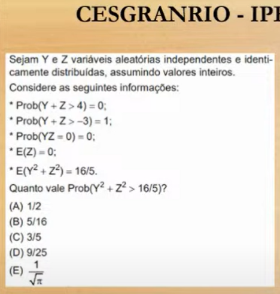
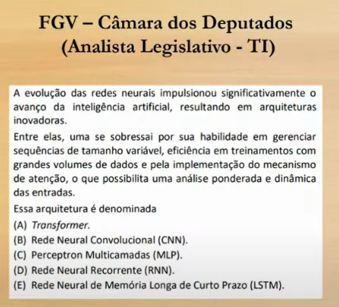
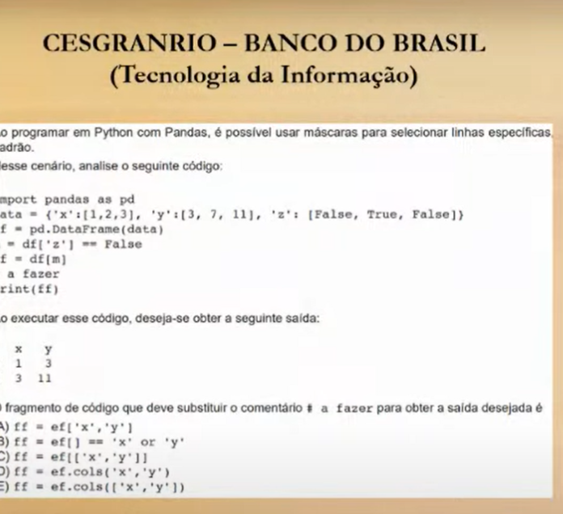

# Fonte

[ANÁLISE TÉCNICA DE EDITAL: BNDES / Ciência de Dados || TI Descomplicada](https://www.youtube.com/watch?v=MeY9uYnqKUk)

# I - Matemática, 31/08

- SVD, PCA, Autovalores autovetores, L1, L2

## Q Fazer 3 integrais, 

## Q Programação linear

´

## Q Normas, SVM, L1, L2

# II - Probabilidade e Estatística, 02/09

- Medida de posição, medida de dispersão
- Teorema de Bayes, central do limite, dos grandes números,
- Inferência estatística. Teste A/B
- Teste Qi^2
- Correções Person
- Inferência Bayesiana, saber MCMC, critério de seleção de modelo BIC e AIC
- Data drifting

## Q1

- bimendionsinalidade, independente distribuídas

## Q2

- Integral tripla ou volume da esfera

## Q3

- BIC, pondera a quantidade de parâmetros com a amostra. Qual a fórmula do BIC? O que é melhor BIC alto ou baixo?

## Q4

- Derivar igualar a z
- Estimador de máxima verosimilhança (uma das mais fáceis de estatística)

## Q5

 
- Estimador não tendencioso de lambda?
- Teste de hipótese está no edital

# III - Finanças Quantitativas

- curva de juros, bootstraping
- Medidas de desempenho e de risco: já cobrou diversas vezes. Sharp ratio and information ratio
- Modelo de média variância sem restrições
- Simulação de Monte Carlo + derivativo (mais comum). Black-scholes

## Q1

 
## Q2

# IV - Dados e Bases de Dados

- conversão para xml?
- tidy data: data set bom padronizado. 
- metodologia TDSP.
- s3, min IO. MongoDb, Cassandra, Redix, o que era índice clusterizado
- Desenhar diagrama ER, modelo orientado a grafos
- Arquitetura lambda?
- Spark, Hadoop. Quente

## Q1

## Q2

- Batch, mini batch ou fluxo?

# V - Gestão de projetos de ciência de dados

## Q1

## Q2

- Estudar LGPD!!!

# VI - Qualidade e Preparação de dados

- normalizção: Zscore, min max, binnning, frequência fixa, k-means, normalizção decil
- encoding, one hot encoding, 
- undersampling, over, 
- validação cruzada, hold one out, k-fold

## Q1

- Reposta E!
- Quando aplicar cada tipo de normalização

## Q2

## Q3

- deduplicação é diferente de matching. 

## Q4

- Adotar o TDSP

# VII - Modelagem

- O que é índice cluster?
- Holdout?

## Q1

## Q2

## Q3

## Q4

# VIII - Classes de modelos (a)

- Faça o PCA na mão!
- Testes de estacionaridade

## Q1

## Q2

## Q3

# VIII - Classes de modelos (b)

- diferenças entre GRU, GAN, LSTM, etc.
- aprendizado por reforço (otimização de carteira)
- ICP, especificações do OCR
- Quantificação de incertezas, muito difícil! Modelos de markov ocultos (conceito)

## Q1

## Q2

- GAN, gera amostras sintéticas: Gerador e discreminador

## Q3

## Q4

# IX - Processamento de Linguagem Natural (NLP)

- NER: name entity recognition. RAG
- Agentes de IA: consulta especializada

## Q1

## Q2

- Zero/few shot learning, transfer learning, gpt 3

## Q3

## Q4

# X - Programação e Ferramentas

- Sintaxe de criação de redes neurais. Keras

## Q1

## Q2

## Q3

# XI - Visualização; Storytelling

## Q1

## Q2

## Q3

## Q4

